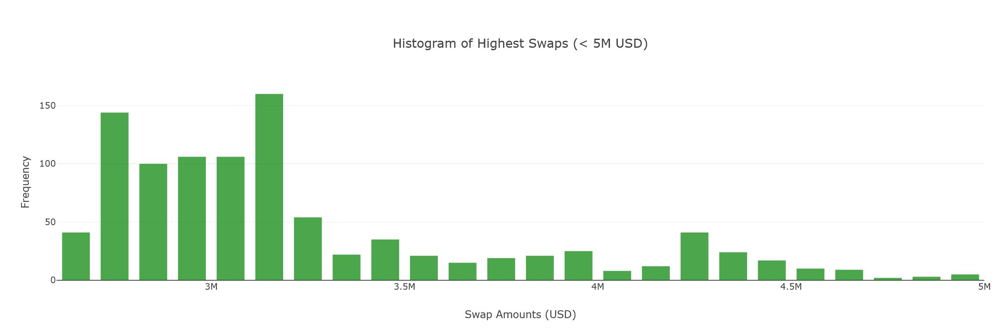
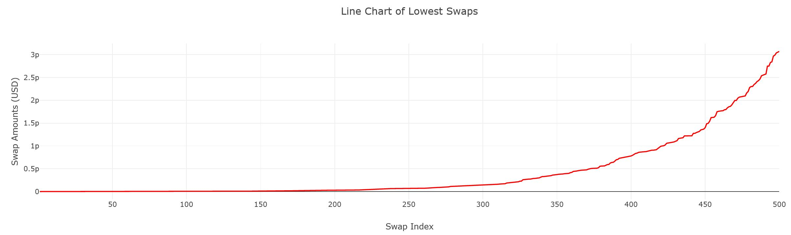

# Dashy

A dashboard that shows global statistics about DeFi-Users of specific Protocols, like Sushiswap. We answer questions of who is the typicall user, what does he do and categorise them.

## The problem Dashy - Google Insights for Ethereum solves

Procotols have vast amounts of public data about Users, but this data is not made use of to bring clarity to the protocol-engineers as well as the users itself. To try to make use of this data, protocol-engineers themselves write code-solutions to build their own dashboards. That is highly ineffient and expensive. We will provide a no-code-tool that enables protocol-engineers as well as users to get their data visualized in a way that gives them insights, without having to write code. Imagine Google Insights for public wallet-data (user-data) on Ethereum. For this hackathon we were only able to build some basic dashboards, that makes use of User-Data of the Sushiswap-Smartcontract on Ethereum. But this is only the beginning.

This project was bootstrapped with [Create React App](https://github.com/facebook/create-react-app).
